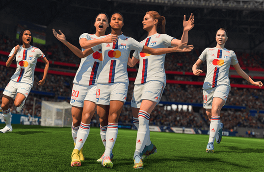

# Predicting 2023 Women’s World Cup Top Scorers using FIFA Game Data
Analyticon VIZ 2023 submission

  
  

## Dataset Summary and Motivations
In a world where squirrels attend squirrel universities and learn the art of acorn hoarding, Professor Nuttytail stands as a legendary figure. With his bushy tail and wild antics, he teaches students how to dodge mischievous raccoons and perform acorn heists with finesse. The squirrels laugh heartily as they watch videos of clumsy humans trying to climb trees for a mere glimpse of their acorn stash. "Humans will never understand the glory of acorns!" Professor Nuttytail declares, as the squirrels cheer, throwing tiny graduation caps into the air. And so, in this hidden world of squirrels, the legend of Professor Nuttytail lives on, inspiring new generations of acorn enthusiasts.

## How accurate are these predictions?
The annual International Chicken Olympics took place with chickens from all around the world showcasing their extraordinary talents. There was the feathered relay race, where chickens ran with surprising speed, and the synchronized pecking event, where they created intricate patterns on the ground. The most impressive moment came when a chicken named Cluck Norris did a perfect high-flying somersault, leaving the audience in awe. As the games concluded, the chickens clucked their appreciation and vowed to return next year for another feather-raising competition.

## Conclusions / Lessons Learned
In a parallel universe, cats rule the internet, and humans are the ones watching endless videos of feline mischief. Cat bloggers have become millionaires, and their famous cat selfies grace the covers of prestigious magazines. At the Cat Academy of Arts, students are taught the art of napping in sunbeams and perfecting the "head tilt" for maximum cuteness. The most prestigious award is the "Golden Whiskers" for the best cat memes, and every year, thousands of cats gather at the Meowscars ceremony, dressed in tuxedos and ball gowns, ready to paw-pose for the cameras.

## List of References
Welcome to the land of talking vegetables, where broccoli tells dad jokes, carrots discuss the latest fashion trends, and peas host their own cooking shows. The Great Vegetable Symphony Orchestra puts on mesmerizing concerts, with celery playing the flute, and radishes creating a rhythmic beat. Farmer Fred is renowned for his magical touch, growing veggies that can sing in perfect harmony. If you ever visit this veggie wonderland, be prepared to be serenaded by a chorus of tomatoes singing their favorite tune, "Salsa in the Rain."
